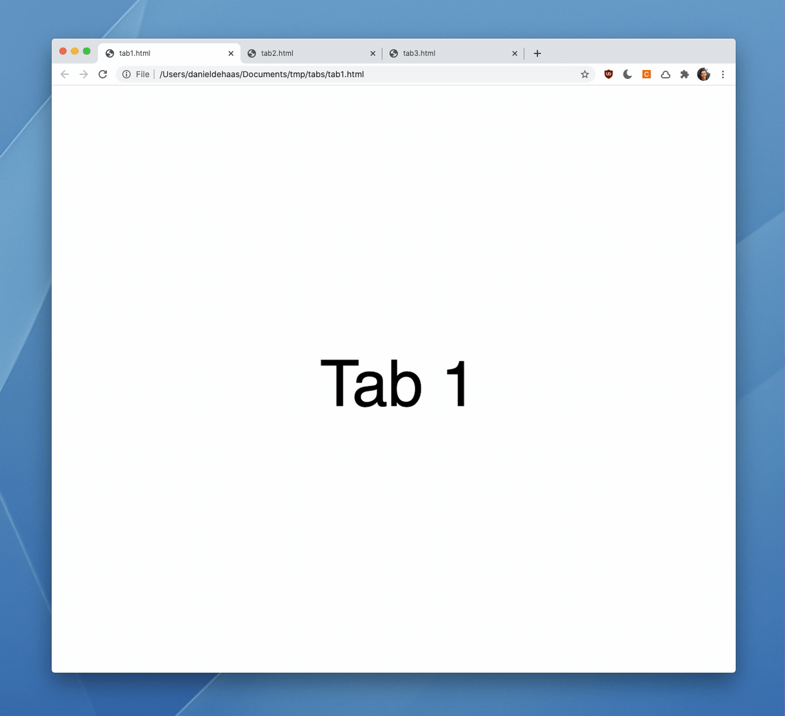

# Tab Rearranger

Browser extension to rearrange tabs and move them between windows with keyboard shortcuts.

This extension is simple, but I can no longer live without it.

Install in [Chrome](https://chrome.google.com/webstore/detail/tab-rearranger/dapkahjmelfklmpmilfdmlggcbnpcndd) or [Firefox](https://addons.mozilla.org/en-US/firefox/addon/tab-rearranger/).

## Installation

This extension uses an older version of the manifest file, but it still works great. To install:

1. Click the green Code button at the top right of the page and select "Download ZIP".
2. Unzip the downloaded file and move the contents to a permanent location on your system. 
3. Navigate to `chrome://extensions`
4. Make sure that "Developer mode" is enabled in the top right corner.
5. Click "Load unpacked" in the upper left corner and select the directory you moved everything to in step 2.

## Usage

| Command | Mac | Windows | Notes |
| ------- | --- | ------- | ----- |
| Move current tab right | `Control+Shift+Right` | `Alt+Shift+Right` | |
| Move current tab left | `Control+Shift+Left` | `Alt+Shift+Left` | |
| Move current tab to new window | `Control+Shift+Up` | `Alt+Shift+Up` | |
| Move current tab to next window | `Control+Shift+N` | `Alt+Shift+N` | |
| Move multiple tabs to a new window | `Control+Shift+M` | `Alt+Shift+M` | Not supported in Firefox |

## Custom keyboard shorcuts

If you'd like, you can specify your own keyboard shortcuts.

I use these shortcuts (they're more Emacsy):

| Command | Mac |
| ------- | --- |
| Move current tab right | `Control+Shift+F` |
| Move current tab left | `Control+Shift+B` |
| Move current tab to new window | `Control+Shift+N` |
| Move current tab to next window | `Control+Shift+P` |
| Move multiple tabs to a new window | `Control+Shift+M` |

### Chrome

1. Go to `chrome://extensions`
2. Click the hamburger icon in the upper left hand corner
3. Click "Keyboard shortcuts"
4. Find Tab Rearranger in this list.

### Firefox

1. Go to `about:addons`
2. Click on the `...` icon next to Tab Rearranger and select "Manage"
3. Click on the cog icon in the upper right hand corner and select "Manage Extension Shortcuts"

## More things I've built

I make things that scratch my own itches, so if you like this you might like some of the other stuff I've built too, like [Keysmith](https://keysmith.app), [Find Hacker News Comments](https://github.com/DanielDe/FindHackerNewsComments), [Window Flicker](https://www.danielde.dev/window-flicker), and [org-web](https://github.com/danielde/org-web).
